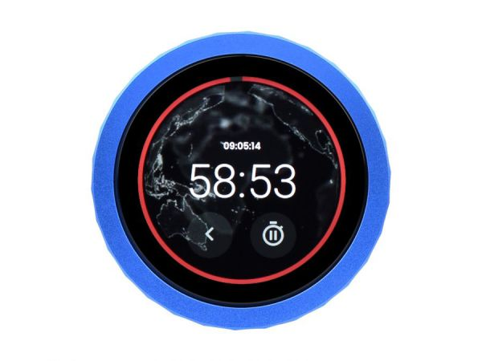
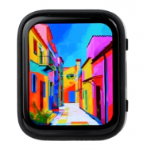

# Waveshare ESP32-S3 Monorepo

Development repo for Waveshare ESP32-S3 devices.

## Devices

| | Device | Description | Display |
|---|--------|-------------|---------|
|  | [Knob](devices/knob/) | [ESP32-S3-Knob-Touch-LCD-1.8](https://www.waveshare.com/esp32-s3-knob-touch-lcd-1.8.htm) — Rotary knob with round IPS LCD 360x360 | ST77916 QSPI |
|  | [AMOLED](devices/amoled/) | [ESP32-S3-Touch-AMOLED-1.8](https://www.waveshare.com/esp32-s3-touch-amoled-1.8.htm) — AMOLED touch watch 368x448 | SH8601 QSPI |

## Structure

```
Waveshare/
├── shared/lib/qspi_panel/     # Common QSPI display driver
├── devices/
│   ├── knob/                  # Knob: projects, lib, docs
│   └── amoled/                # AMOLED: projects, lib, docs
└── build.ps1                  # Build script
```

## Build

Prerequis : [PlatformIO Core (CLI)](https://docs.platformio.org/en/latest/core/installation.html)

```powershell
.\build.ps1 knob Basic_Blink                   # Build un projet
.\build.ps1 knob Basic_Blink -Upload           # Build + flash (autodetect port)
.\build.ps1 knob Basic_Blink -Upload -Monitor  # Build + flash + monitor serie
.\build.ps1 knob -Clean                   # Clean + rebuild tous les projets du device
.\build.ps1 -ListDevices                  # Lister les devices disponibles
```
