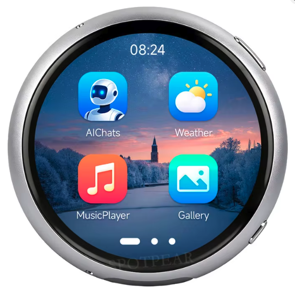

# Waveshare ESP32-S3 Monorepo

Development repo for Waveshare ESP32-S3 devices.

## Devices

| | Device | Description | Display |
|---|--------|-------------|---------|
|  | [Knob](devices/knob/) | [ESP32-S3-Knob-Touch-LCD-1.8](https://www.waveshare.com/esp32-s3-knob-touch-lcd-1.8.htm) — Rotary knob with round IPS LCD 360x360 | ST77916 QSPI |
|  | [AMOLED 1.8](devices/amoled/) | [ESP32-S3-Touch-AMOLED-1.8](https://www.waveshare.com/esp32-s3-touch-amoled-1.8.htm) — AMOLED touch watch 368x448 | SH8601 QSPI |
|  | [AMOLED 1.75C](devices/amoled_175c/) | [ESP32-S3-Touch-AMOLED-1.75C](https://www.waveshare.com/wiki/ESP32-S3-Touch-AMOLED-1.75C) — Round AMOLED watch 466×466 (CST9217 touch, ES8311+ES7210, AXP2101, QMI8658) | CO5300 QSPI |
|  | [Guition Knob](devices/guition_knob/) | Guition JC3636K718 — Rotary knob with round IPS LCD 360x360 + **13×WS2812 RGB ring** | ST77916 QSPI |

## Structure

```
Waveshare/
├── shared/lib/qspi_panel/        # Common QSPI display host (utilisé par tous les devices)
├── devices/
│   ├── knob/                     # Waveshare Knob (ST77916)
│   ├── amoled/                   # Waveshare AMOLED 1.8 (SH8601)
│   ├── amoled_175c/              # Waveshare AMOLED 1.75C (CO5300, round)
│   └── guition_knob/             # Guition JC3636K718 (ST77916 + RGB ring)
├── build.ps1                     # Build script (Windows / PowerShell)
├── build.sh                      # Build script (macOS / Linux / bash)
├── tools/device_mac.py           # Helper MAC ↔ device_dir (check + identify)
└── devices.local.yaml            # Inventaire MAC local (gitignored)
```

## Build

Prérequis : [PlatformIO Core (CLI)](https://docs.platformio.org/en/latest/core/installation.html)
- **Windows** → [docs/install/windows.md](docs/install/windows.md)
- **macOS** → [docs/install/macos.md](docs/install/macos.md)

### Windows (PowerShell)

```powershell
.\build.ps1 knob Basic_Blink                   # Build
.\build.ps1 knob Basic_Blink -Upload           # Build + flash (autodetect port)
.\build.ps1 knob Basic_Blink -Upload -Monitor  # Build + flash + monitor série
.\build.ps1 auto Basic_Blink -Upload           # Identifier le device par MAC, puis build + flash
.\build.ps1 knob -Clean                        # Clean + rebuild tous les projets du device
.\build.ps1 -ListDevices                       # Lister les devices disponibles
```

### macOS / Linux (bash)

```bash
./build.sh knob Basic_Blink                    # Build
./build.sh knob Basic_Blink --upload           # Build + flash (autodetect port)
./build.sh knob Basic_Blink --upload --monitor # Build + flash + monitor série
./build.sh auto Basic_Blink --upload           # Identifier le device par MAC, puis build + flash
./build.sh knob --clean                        # Clean + rebuild tous les projets du device
./build.sh --list-devices                      # Lister les devices disponibles
```

> Plusieurs devices partagent `VID:303A PID:1001` — chaque flash vérifie le MAC contre `devices.local.yaml` pour éviter de flasher le mauvais board. Premier setup : `python3 tools/device_mac.py scan` puis copier le MAC dans `devices.local.yaml`.
