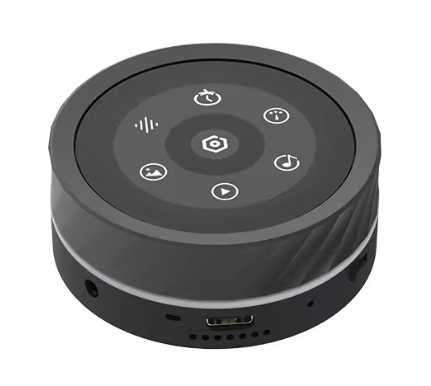

# Guition JC3636K718 — Knob ESP32-S3 avec anneau RGB



Carte rotative ESP32-S3 avec écran rond 1.8" 360×360 (ST77916 QSPI), encoder bidirectionnel, audio DAC, micro, SD card, haptics DRV2605 + LRA, et **anneau de 13 LEDs WS2812 pilotable** (GRB, data sur GPIO 0).

Variante très proche du [Waveshare ESP32-S3-Knob-Touch-LCD-1.8](https://www.waveshare.com/esp32-s3-knob-touch-lcd-1.8.htm) mais avec pinout entièrement différent et l'ajout de l'anneau RGB.

## Projets

| Projet | Description | Périphériques utilisés |
|--------|-------------|------------------------|
| [Basic_Blink](projects/Basic_Blink/) | Écran clignotant (vert/rouge) | Display QSPI, backlight PWM |
| [Basic_RGB_Ring](projects/Basic_RGB_Ring/) | Rotation arc-en-ciel sur les 13 LEDs | RGB ring (WS2812 sur GPIO 0) |
| [Basic_Audio](projects/Basic_Audio/) | Beep 440 Hz intermittent (vol. via encoder) | I2S → PCM5100A → ampli NS4150B → HP onboard, encoder |
| [Basic_Audio_Harp](projects/Basic_Audio_Harp/) | Arpège Cmaj7 synthèse Karplus-Strong (vol. via encoder) | I2S → PCM5100A → HP onboard, encoder |
| [Basic_Audio_Ping](projects/Basic_Audio_Ping/) | "Ping" type cloche (additive synth, vol. via encoder) | I2S → PCM5100A → HP onboard, encoder |
| [Basic_Audio_Talkie](projects/Basic_Audio_Talkie/) | TTS robotique LPC (phrases iconic US, vol. via encoder) | I2S → PCM5100A → HP onboard, encoder, `TalkiePCM` |
| [Basic_Audio_Speak](projects/Basic_Audio_Speak/) | TTS sample-based multilingue (Thomas/Amélie/Samantha/Alice, vol. via encoder) | I2S → PCM5100A → HP onboard, encoder, PCM embed |
| [Basic_LVGL_Meter](projects/Basic_LVGL_Meter/) | Cadran type compteur de vitesse 0-100 pilote par encoder | Display QSPI, LVGL `lv_meter`, encoder |
| [Hue_Encoder](projects/Hue_Encoder/) | Roue de teintes HSV avec hex live ; tap pour toggle haptics | Display + LVGL, encoder, **DRV2605 haptics**, **CST816 touch** (port du Knob) |

## Structure

```
devices/guition_knob/
├── lib/guition_knob_hw/             # Pins, display, LVGL, encoder
├── projects/
│   ├── Basic_Blink/
│   ├── Basic_RGB_Ring/
│   ├── Basic_Audio/
│   ├── Basic_Audio_Harp/
│   ├── Basic_Audio_Ping/
│   ├── Basic_Audio_Talkie/
│   ├── Basic_Audio_Speak/
│   └── Basic_LVGL_Meter/
└── docs/
    ├── datasheets/                  # ST77916 INI, PCM5100A, ESP32-S3R8
    ├── demo-code/                   # Demo Guition (Arduino + ESP-IDF, dont led_strip)
    ├── dimensions/                  # Cotes mécaniques
    ├── instructions/                # PDFs utilisation
    └── schematics/                  # Schémas (PDF)
```

Les projets utilisent `lib/guition_knob_hw/` (pins, init display via `guition_display.h`, init LVGL via `guition_lvgl.h`, encoder) et `shared/lib/qspi_panel/` (driver QSPI `esp_lcd_sh8601`, partagé avec le Knob Waveshare).

## Build et flash

> ⚠️ **Premier flash** : la carte arrive avec un firmware vendor qui expose une clé USB-MSC (pas de port CDC). Il faut entrer manuellement en mode download (maintenir BOOT, brancher USB, relâcher BOOT) avant le premier `--upload`. Voir [CLAUDE.md](CLAUDE.md#first-flash--mode-download-manuel-obligatoire) pour le détail.


Depuis la racine du monorepo :

```powershell
# Windows
.\build.ps1 guition_knob Basic_Blink                   # Build
.\build.ps1 guition_knob Basic_Blink -Upload -Monitor  # Build + flash + moniteur
```

```bash
# macOS / Linux
./build.sh guition_knob Basic_Blink                    # Build
./build.sh guition_knob Basic_Blink --upload --monitor # Build + flash + moniteur
```
